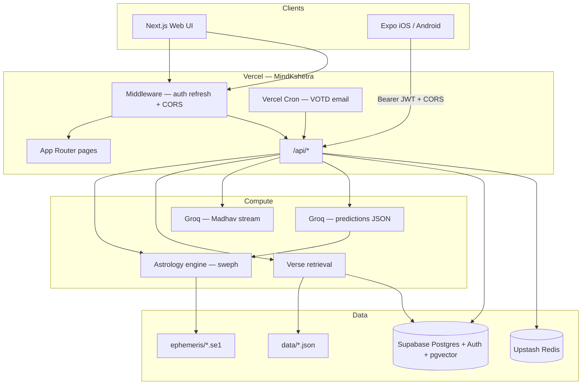
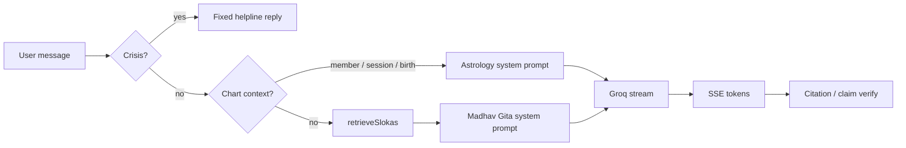
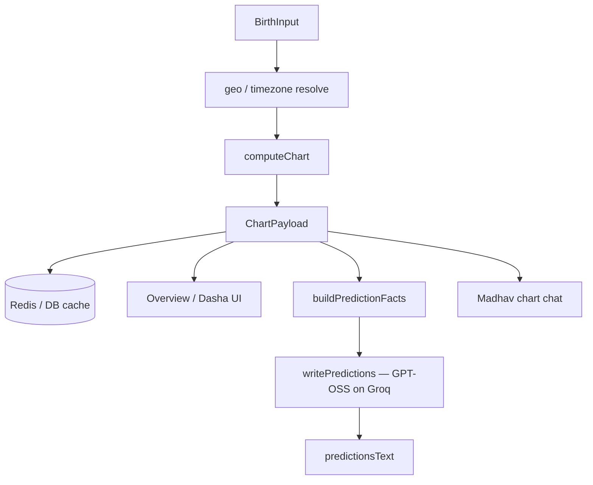

# MindKshetra architecture

End-to-end architecture for the MindKshetra product: the **web API + Gita/Jyotish engine** ([MindKshetra](https://github.com/LogitsLab/MindKshetra)) and the **Expo mobile client** ([MindKshetra-app](https://github.com/LogitsLab/MindKshetra-app)).

Live site: [https://mind.logitslab.com](https://mind.logitslab.com)

---

## 1. System overview



| Layer | Responsibility |
|-------|----------------|
| **Web UI** | Marketing surface + full Gita/astrology experience in the browser |
| **Mobile app** | Native UX; same APIs; Supabase Auth with Bearer tokens |
| **API** | Content, chat, account, astrology compute/predictions |
| **Engine** | Deterministic Jyotish math (Swiss Ephemeris) |
| **LLM** | Prose only — Madhav chat + prediction write-ups over fact packs |
| **Supabase** | Auth, user data, optional verse DB + embeddings |
| **Redis** | Shared rate limits + short-lived caches across serverless instances |

---

## 2. Repositories

| Repo | Role | Deploy |
|------|------|--------|
| `LogitsLab/MindKshetra` | Next.js 14 App Router, astrology engine, all `/api` routes | Vercel (`main` → GitHub Actions → production) |
| `LogitsLab/MindKshetra-app` | Expo Router (SDK 54) client | EAS Build + Submit (TestFlight / Play internal) |

Mobile never embeds the ephemeris engine: it calls `POST /api/astrology/*` on the web backend.

---

## 3. Web application structure

```
MindKshetra/
  app/                 # Pages + app/api/*
  components/          # UI including components/astrology/*
  lib/                 # Server logic (content, chat, astrology, infra)
  data/                # Local JSON verses / chapters / story seeds
  supabase/migrations/ # 001–009 schema
  ephemeris/           # Swiss Ephemeris .se1 (packaged into Lambdas)
  scripts/             # Seed, embeddings, eval, QA
  test/                # Vitest golden / unit tests
  docs/                # api.md, design, eval baseline
  middleware.ts        # Session + CORS + OAuth redirect fix
  vercel.json          # Cron schedule
```

### Key `lib/` areas

| Area | Modules | Notes |
|------|---------|-------|
| **Astrology** | `lib/astrology/engine.ts`, `swe.ts`, `dasha.ts`, `blend.ts`, `predictions.ts`, … | `computeChart` → full `ChartPayload`; predictions enrich facts then call Groq |
| **Chat / RAG** | `retrieve.ts`, `groq.ts`, `cite.ts`, `chat-store.ts`, `crisis.ts`, `bridge/*` | Tag (+ optional Voyage) retrieval; streamed Madhav; citation verify |
| **Content** | `lib/content/{source,index,json,db}.ts` | `CONTENT_SOURCE=json\|db` with JSON fallback |
| **Auth / DB** | `lib/supabase/{client,server,admin}.ts` | Cookie session (web) or `Authorization: Bearer` (mobile) |
| **Infra** | `redis.ts`, `rateLimit.ts`, `votd-email.ts`, `stories.ts` | Upstash or in-memory fallback |

---

## 4. Mobile application structure

```
MindKshetra-app/
  app/                 # Expo Router screens (tabs + stack + modal Madhav)
  src/api/             # apiFetch + SSE streamChat + endpoints
  src/auth/            # Supabase client, redirects
  src/context/         # Auth, Madhav, Language, Theme, TextScale, Onboarding
  src/components/      # UI + astrology panels
  src/i18n/            # en / hi dictionaries
  src/theme/           # Design tokens (aligned with web DESIGN.md)
  src/storage/         # AsyncStorage (prefs, guest progress, chat session)
  store/               # Store listing + per-version release notes
```

**Tabs:** Home · Explore · Mood · Astrology. **Madhav** is a FAB → modal (`app/madhav.tsx`), not a tab.

**Provider order:** Theme → TextScale → Language → Onboarding → Auth → Madhav.

See also mobile-focused notes in the app repo’s [ARCHITECTURE.md](https://github.com/LogitsLab/MindKshetra-app/blob/main/ARCHITECTURE.md).

---

## 5. Auth model

```mermaid
sequenceDiagram
  participant User
  participant Client as Web or Expo
  participant MW as Next middleware
  participant API as /api/*
  participant SB as Supabase Auth

  User->>Client: Sign in (Google / email / Apple / anonymous)
  Client->>SB: OAuth / OTP / signInAnonymously
  SB-->>Client: Session (access_token)

  Note over Client,API: Web sends cookies; Expo sends Bearer
  Client->>MW: Request
  MW->>SB: Refresh cookie session (if no Bearer)
  MW->>API: Forward
  API->>SB: getUser via cookie or JWT
```

- **`getAuthUserId()`** — any valid user including anonymous  
- **`getSignedInUserId()`** — non-anonymous only (saved members, etc.)  
- Guests: local progress + anonymous chat; merge endpoints attach data after upgrade  
- Astrology guests: opaque `chartSessionId` (incognito cache), separate from chat `sessionId`

---

## 6. Content modes

| Mode | When | Behavior |
|------|------|----------|
| **JSON** | Default / no Supabase | Verses from `data/slokas.json` |
| **DB** | `CONTENT_SOURCE=db` + Supabase | Postgres content; **falls back to JSON on errors** |
| **Hybrid RAG** | DB + embeddings + `VOYAGE_API_KEY` | Tag score + vector retrieval for Madhav |

User-generated data (favorites, journal, chat history, astrology members) requires Supabase.

---

## 7. Madhav chat pipeline



- **Endpoint:** `POST /api/chat` (SSE). Deprecated `POST /api/astrology/chat` re-exports the same handler.  
- **Chart-linked chat** skips Gita RAG and uses chart-grounded prompts only.  
- **Mobile** uses `expo/fetch` for true streaming; web uses `EventSource`-style consumption in the UI.

---

## 8. Astrology pipeline



**Deterministic engine (`computeChart`)** produces: planets, houses, Vimshottari dashas, yogas, aspects, D9/D10, KP, Lal Kitab hooks, panchang, blended life-area verdicts.

**LLM predictions** only narrate an enriched fact pack (degrees, KP lines, dasha windows, D9/D10, anchors). Fallback `source: "rules"` if Groq is unavailable.

**Near-term timing** prefers current antar/pratyantar boundaries over calendar +12 months.

---

## 9. Primary API surface

| Area | Routes (summary) |
|------|------------------|
| **Health** | `GET /api/health`, `GET /api/astrology/health` |
| **Content** | `/api/slokas`, `/api/moods`, stories |
| **Chat** | `POST /api/chat`, sessions list/get/merge |
| **Astrology** | `compute`, `predictions`, `members`, `geocode`, `resolve-birth`, `compatibility` |
| **Account** | favorites, journal, streak, preferences, export, progress |
| **VOTD** | `/api/votd/email`, `/api/cron/votd-email` |
| **OG** | `/api/og/verse/[id]`, `/api/og/story/[id]` |

Full contracts: [`docs/api.md`](docs/api.md).

**Rate limits** (Redis sliding window, in-memory fallback): chat ~20/min/IP; compute ~20/min; predictions ~10/min.

---

## 10. Caching

| Data | Where | Notes |
|------|-------|-------|
| Incognito charts / predictions | Redis or memory | TTL ~6h; keyed by `chartSessionId` |
| Member charts | `astrology_chart_cache` | Invalidated with `ENGINE_VERSION` |
| Verse stories | Redis / DB variants | Regenerable via API |
| Rate-limit counters | Redis | Per-route key + client IP |

Without Redis on Vercel, each Lambda keeps only process-local memory — fine for light traffic, wrong for shared limits.

---

## 11. Deploy & CI

### Web
- Push to `main` → `.github/workflows/deploy.yml` → Vercel production  
- Cron: `30 2 * * *` UTC → `/api/cron/votd-email` (08:00 IST)  
- Ephemeris files must be present in the deployment artifact (`/api/astrology/health` → `swiss`)

### Mobile
- Version bump on `main` (or manual workflow) → EAS `production` build  
- Auto-submit: iOS TestFlight; Android Play **internal** track by default  
- Marketing version: `app.json` `expo.version`; native build numbers: EAS remote auto-increment  
- Release notes: `store/release-notes/<version>.md`

---

## 12. Environment variables

### Web (Vercel / `.env.local`)

Tiers say what breaks without the var. **Core needs no env at all**: verses
ship in the repo (`CONTENT_SOURCE` defaults to `json`) and account surfaces
run in guest mode. Routes that hard-require Supabase answer
`503 "Supabase is not configured on this deployment"` when its vars are
absent (`lib/supabase/require.ts`).

| Variable | Tier | Purpose |
|----------|------|---------|
| `GROQ_API_KEY` | AI | Madhav chat, verse stories, chart readings |
| `GROQ_MODEL` | AI (opt) | Chat model override (default in `lib/groq.ts`) |
| `GROQ_PREDICTIONS_MODEL` | AI (opt) | One-shot chart-reading model override |
| `GROQ_PREDICTIONS_REASONING_EFFORT` | AI (opt) | Reasoning effort for chart readings |
| `NEXT_PUBLIC_SUPABASE_URL` | accounts | Supabase project URL (auth + user data) |
| `NEXT_PUBLIC_SUPABASE_ANON_KEY` | accounts | Supabase publishable key |
| `SUPABASE_SERVICE_ROLE_KEY` | accounts | Service-role writes (moderation queue, push tokens, events sink); seed/migrate scripts |
| `CONTENT_SOURCE` | accounts (opt) | `json` (default, verses from repo) or `db` (Supabase + seed) |
| `RESEND_API_KEY` | email | Verse-of-the-Day sends via Resend |
| `RESEND_FROM` | email (opt) | From address (defaults to the verified prod sender) |
| `CRON_SECRET` | ops | Bearer auth for `/api/cron/*` (VOTD broadcast, push dispatch) |
| `MAINTAINER_USER_IDS` | ops | Comma-separated auth ids for `/api/admin/moderation`; empty fails closed |
| `COMMUNITY_REFLECTIONS_ENABLED` | ops | Kill switch — set `0/false/off/no` to pause NEW reflection sharing (unsharing keeps working) |
| `COMMUNITY_REPORTS_ENABLED` | ops | Kill switch — same off-spellings pause user reports |
| `NEXT_PUBLIC_SITE_URL` | optional | Canonical origin for OG/share/email links + PKCE recovery (prod default) |
| `UPSTASH_REDIS_REST_URL` / `UPSTASH_REDIS_REST_TOKEN` | optional | Shared rate limits + story/incognito-chart cache; in-memory fallback without |
| `VOYAGE_API_KEY` | optional | Hybrid vector retrieval (needs `db` content + embeddings); tag-only fallback |
| `NOMINATIM_USER_AGENT` | optional | Geocoding User-Agent per OpenStreetMap policy |
| `STORY_CACHE_MEMORY_ONLY` | optional | Dev: skip the on-disk story cache |
| `NEXT_PUBLIC_WHATSAPP_CHANNEL_URL` / `NEXT_PUBLIC_TELEGRAM_URL` | optional | Footer/support community links; hidden when unset |
| `NEXT_PUBLIC_RAZORPAY_DONATION_URL` / `NEXT_PUBLIC_OPEN_COLLECTIVE_URL` / `NEXT_PUBLIC_GITHUB_SPONSORS_URL` | optional | Support-page donate links; hidden when unset |

Scripts/CI only (never needed by the running app): `SUPABASE_ACCESS_TOKEN`
(`npm run db:migrate` auth), `EVAL_HYBRID`, `EVAL_HYBRID_MIN_RATE`,
`EVAL_HYBRID_MIN_EMBEDDINGS`, `EVAL_VOYAGE_DELAY_MS`, `EMBED_DELAY_MS`,
`STORY_PREGEN_DELAY_MS`, `SPIKE_VOYAGE_DELAY_MS`, `GITHUB_BEFORE_SHA`.
`NODE_ENV` / `VERCEL` are platform-set.

### Mobile (EAS env + local `.env`)

| Variable | Purpose |
|----------|---------|
| `EXPO_PUBLIC_API_URL` | Web API origin |
| `EXPO_PUBLIC_SUPABASE_URL` | Auth |
| `EXPO_PUBLIC_SUPABASE_ANON_KEY` | Auth (public) |

Maintainer CI secrets (not in git): `VERCEL_*`, `EXPO_TOKEN`, `GOOGLE_SERVICE_ACCOUNT_JSON`, `VERSION_BUMP_TOKEN`.

---

## 13. Design principles

1. **Ephemeris is source of truth** — LLMs never invent placements or dates.  
2. **One chat endpoint** — Gita vs chart mode selected by request context.  
3. **Graceful degradation** — JSON content, in-memory cache, rules-based predictions when keys/Redis are missing.  
4. **Dual clients, one API** — cookies for web, Bearer for mobile, CORS enabled on `/api/*`.  
5. **Eval when touching prompts / retrieval** — `npm run eval` vs `docs/eval-baseline.md`; astrology goldens under `test/`.  
6. **Crisis safety** — fixed helpline path; no LLM, no astrology fatalism/medical claims in prompts.

---

## 14. Related docs

| Doc | Content |
|-----|---------|
| [README.md](README.md) | Quick start, contributing invite |
| [CONTRIBUTING.md](CONTRIBUTING.md) | Issues & PRs |
| [docs/api.md](docs/api.md) | HTTP contracts |
| [DESIGN.md](DESIGN.md) | Visual system |
| [`.env.example`](.env.example) | Env template |

Questions or ideas? [Open an issue](https://github.com/LogitsLab/MindKshetra/issues) with as much detail as you can.
